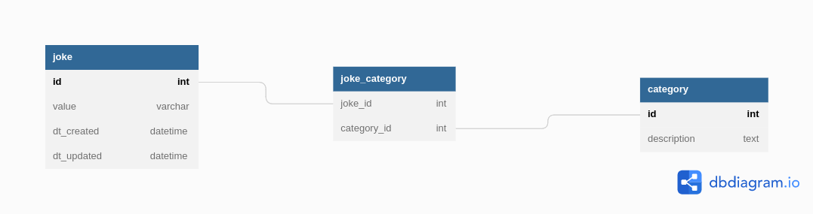

# Reto SQUADMARKER
## Instalación

**Linux**

```bash
sudo apt-get install python3-pip -y
sudo pip3 install virtualenv
virtualenv env
source env/bin/activate
pip install -r requirements.txt
```

**Window**

```bash
pip install virtualenv
virtualenv env
.\env\Scripts\activate
pip install -r requirements.txt
```

### Correr servidor

Una vez tienes el entorno activado, tecleas el siguiente comando en la terminal:

```bash
uvicorn  main:app
```

### Probar los endpoints

```bash
http://localhost:8000/docs
```


### ¿Qué repositorio utilizarías?

Postgresql, sería la opción que utilizaría para construir la base de datos, debido a los siguiente aspecto:

- **Replicación de tablas de base de datos:** esto es una alternativa a celery si tengo que mantener una base datos local con la del cloud sincronizada.
- **PSQL**: puedo programar procedimientos tanto en PSQL nativo o python.
- **DBLink**: Esta opción la usaría en caso de que me dieran una base de datos de chistes en PostgresSQL con otro esquema, diferente y necesitara migrar la información a mi base de datos personal, ya que todo lo podría hacer mediante sql y no tengo que escribir un programa en un lenguaje X para hacer la migración.

### Model DB


```sql
CREATE DATABASE joke;
CREATE USER joke WITH ENCRYPTED PASSWORD 'joke';
GRANT ALL PRIVILEGES ON DATABASE joke to joke;
ALTER DATABASE joke OWNER TO joke;
ALTER USER joke WITH SUPERUSER;

CREATE TABLE IF NOT EXISTS joke(
  id serial PRIMARY KEY,
  value Text NOT NULL,
	dt_creadted TIMESTAMP WITHOUT TIME ZONE DEFAULT now(),
	dt_updated TIMESTAMP WITHOUT TIME ZONE
);

CREATE TABLE "joke_category" (
  joke_id int,
  category_id int,
	CONSTRAINT fk_joke FOREIGN KEY(joke_id) REFERENCES joke(id),
	CONSTRAINT fk_category FOREIGN KEY(category_id) REFERENCES category(id)
);

CREATE TABLE IF NOT EXISTS category(
	id serial PRIMARY KEY,
	description VARCHAR(30) NOT NULL
);

```

### NoSQL

No he trabajado con una base de datos puramente de NoSQL como MongoDB; sin embargo, no debe ser muy diferentes a utilizar JSON o JSONB en **Postgresql,** yo lo resolveria con postgres de la siguiente forma:

```sql
CREATE TABLE IF NOT EXISTS jokes
(
	id serial not null primary key,
	joke_coll JSON NOT NULL
)
```

El JSON que almacenaría seria:

```json
{
	"id": "cdb14732-776a-4ff7-9edb-6f7b14e62f47",
	"value": "Hay un hombre que vendio su casa para comprar los muebles",
	"category": "Chistes malos" 
}
```

### Mínimo común múltiplo

```python
2 - 5 - 8 -9 | 2
1 - 5 - 4 -9 | 2
1 - 5 - 2 -9 | 2
1 - 5 - 1 -9 | 3
1 - 5 - 1 -3 | 3
1 - 5 - 1 -1 | 5
1 - 1 - 1 -1 |
```

Mi algoritmo para la resolución del mínimo común múltiplo lo basé en esta forma, pero mi algoritmo en el código varía un poco, ya que uso dos  bucles **while** anidados, porque necesito conocer el estado de la lista original y el otro hace las modificaciones sobre una copia de la lista. El interno sé encargar de hacer el recorrido, para ir buscando los números que son divisible por el divisor actual

Cuando los resultados de la división llegan a 1, los saco de la lista original.

Y para ir guardando los números que se utilizan para dividir verifico si en ya se dividió en la misma línea algún número por el divisor base, y guarda ese divisor en una lista.

Cuando el algoritmo inicia nuevamente comprueba la longitud, ya que esta actúa como el estado de la lista que esto modificando. Una vez la lista esta vacia ya tengo guardado todos los divisor comunes y los devuelvo